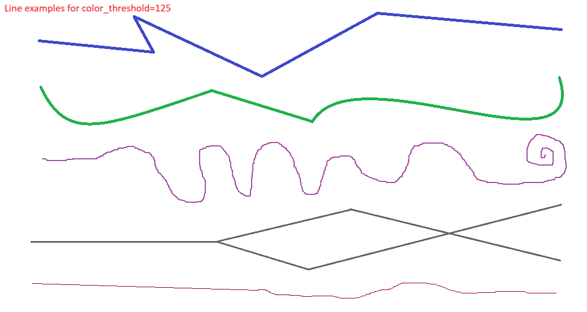
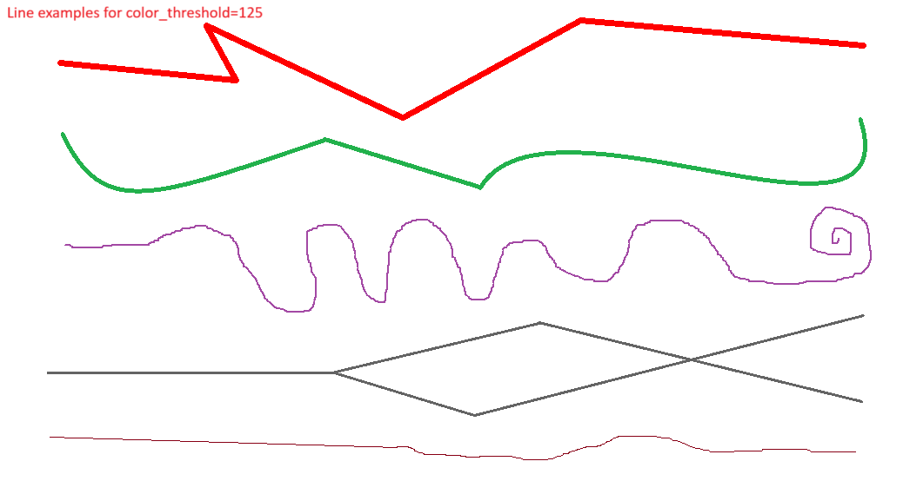

# Greedy Line Follower

**Greedy Line Follower** is a simple computer vision project that demonstrates a greedy algorithm for tracing a dark line in an image, starting from a user-selected point. Demonstrates how a basic greedy heuristic follows high-contrast paths (e.g., dark lines on white backgrounds) using only pixel intensity and local neighborhood analysis.

This project is great for showcasing pathfinding logic, OpenCV techniques, and algorithm design in Python. It has been generalized from a work project originally developed at Boeing and now supports any image containing a distinguishable dark path.

### The algorithm
- Converts the input image to grayscale using OpenCV.
- Starts from a user-selected point and uses greedy search to follow the darkest unvisited neighboring pixel.
- Continues tracing pixel-by-pixel until no darker unvisited neighbors remain.
- Outputs a new image with the traced path highlighted.


## Features
1. **Interactive**: Starting point is selected via mouse click on the displayed image
2. **Greedy algorithm**: Chooses the next darkest unvisited neighboring pixel
3. **8-connected search**: Considers all directions — up, down, left, right, and diagonals
4. **Threshold tuning**: Adjustable grayscale threshold for defining "dark" pixels
5. **Minimal dependencies**: Built with just OpenCV and NumPy
6. **Lightweight and educational**: Great for learning pathfinding and OpenCV basics


## Example Use Cases
- Pathfinding demos
- Visual debugging of skeletonized paths
- CV-based flow diagrams or scanned maps


## Directory Structure
The project is organized as follows:
```bash
GreedyLineFollower/
├── example_inputs/             ← Folder with input images (e.g., line1.png)
├── output/                     ← Folder where traced images will be saved
├── .gitignore                  ← Ignore environment/dev files for Git
├── line_follower.py            ← Core greedy path-finding logic
├── main.py                     ← Run this script to trace a line on an image
├── requirements.txt            ← Python dependencies
└── README.md                   ← You’re here!
```


## Example
An example input image is shown below:


After a starting point is selected on the blue line, the algorithm follows the path using greedy pixel selection and generates an output image with the traced line overlaid in red:


Any visible line in the input image can be traced by clicking on it, producing a similar red-highlighted path.


## How It Works
1. The program loads the input image and converts it to grayscale.
2. The user selects a starting point by clicking on the image.
3. The algorithm searches all 8 neighboring pixels (up, down, left, right, and diagonals).
4. It greedily moves to the darkest unvisited neighbor.
5. This process repeats until no darker unvisited neighbors are available.
6. The final traced path is drawn over the original image and saved.


## How to Run
### Installation
Clone the repository and install the required dependencies:
```bash
git clone https://github.com/your-username/GreedyLineFollower.git
cd GreedyLineFollower
pip install -r requirements.txt
```

### Usage
Place your input image (e.g., a line drawing) in the `example_inputs` folder, then run:
```bash
python main.py
```
A starting point is chosen via mouse click on the line. The traced output is saved to the `output` folder.

### Configuration
The grayscale threshold that defines what counts as a “dark” pixel can be adjusted in `main.py`:
```bash
follower = GreedyLineFollower(color_threshold=125)
```
- Lower values (e.g., 50) make the algorithm stricter, following only very dark pixels.
- Higher values (e.g., 200) allow lighter grayscale pixels to be considered part of the path.

> The default value is set to `125`. You can find an example that works better with a higher threshold in `example_inputs/line2.png`.


## Dependencies
This project requires the following Python packages:
- opencv-python
- numpy


## Limitations
- **Designed for simple, high-contrast images**: Works best on images with a clear, continuous dark line over a light background. Low-contrast or noisy images may produce inaccurate traces.
- **Greedy-only logic**: The algorithm does not use backtracking or global optimization, so it may fail in complex junctions, loops, or intersecting paths.
- **Single-path tracing**: Only one path is traced per user click — the tool doesn't support batch processing or automatic path detection.
- **Manual starting point**: Requires manual selection of the starting point; automatic endpoint detection is not supported.
- **No support for overlapping lines**: Multiple or branching paths are not handled — the greedy logic may pick one direction arbitrarily.
- **Threshold sensitivity**: The behavior of the algorithm is heavily dependent on the grayscale threshold value. Improper tuning may skip segments or follow unintended areas.
- **No error handling for off-path clicks**: Traces may fail silently or inaccurately if the selected point is not near a sufficiently dark pixel.
<br>
<br>

---

**Author:** *Janith Perera*  
M.S. in Data Science | [LinkedIn](https://www.linkedin.com/in/janith-perera-3941821a2/)